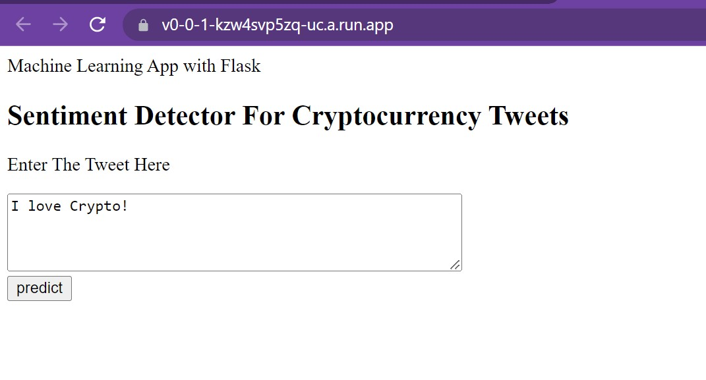
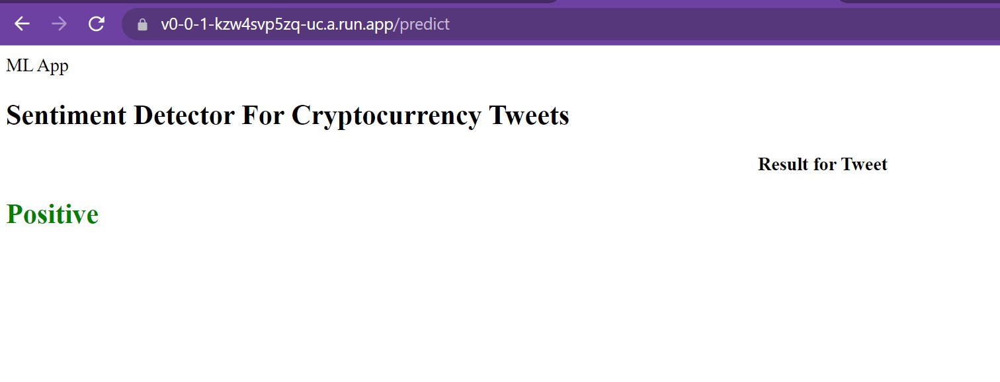

# Sentiment Analysis for Cryptocurrency Tweets
> This project structure follows the format suggested in this [_tutorial_](https://github.com/FilippoBovo/production-data-science).
> Deployed application can be found [_here_](https://v0-0-1-kzw4svp5zq-uc.a.run.app/). <!-- If you have the project hosted somewhere, include the link here. -->

## Table of Contents
* [General Info](#general-information)
* [Technologies Used](#technologies-used)
* [Features](#features)
* [Screenshots](#screenshots)
* [Setup](#setup)
* [Project Status](#project-status)
* [Room for Improvement](#room-for-improvement)
* [Acknowledgements](#acknowledgements)
* [Contact](#contact)
<!-- * [License](#license) -->

## General Information
“Bitcoin skyrocketed as much as 20% on Friday after Elon Musk added the hashtag #bitcoin to his Twitter bio.
The virtual currency climbed suddenly at around 3:30 a.m. ET, adding $5,000 in the space of an hour to trade at $37,299, according to data from industry site CoinDesk. At 8:00 a.m. ET, it extended gains to trade around $37,653.” states CNBC article from Jan 29th of 2021 showcasing how sensitive the digital currency’s trading value is to comments posted on social media platforms like Twitter by influential accounts like Musk’s. Inspired by phenomena as such that we have all witnessed over the course of past few years, we concluded that it would be really powerful to be able to perform the sentiment analysis on Cryptocurrency related tweets on a particular day/hour  and predict the pertaining leading sentiment regarding the crypto currency and maybe review one’s investment decisions accordingly. With this motivation, in this project, we are attempting to solve the underlying prediction problem to this usecase.This idea, not surprisingly, has already been explored in the ML community before. We managed extract labeled tweets from the past few years that we used to train and test our model. 

This prediction problem is a supervised classification usecase where Cryptocurrency tweets are classified as “positive”, “neutral” or “negative”. Being a NLP usecase, due to the high cost of the training process of a neural net from scratch, we leveraged a small, fast, cheap and light Transformer model trained by distilling BERT base, DistilBERT. Tweets are first tokenized using DistilBert tokenizer and model is then retrained with our labeled [_data_](./Exploration/data/bitcointweets.csv)
- The notebook used for data wrangling can be found [_here_](./Exploration/datacleansing/DataCleansingNotebook.ipynb)
- The notebook used for model training, testing, saving can be found [_here_](./Exploration/modeltraining/Bert.ipynb) Although light-weight DistilBERT model still requires GPU usage for inferencing as well as re-training. We used Paperspace platform & Tesla V100 machine to run our notebook.
- The scripts in the aforementioned two notebooks are then refactored into CryptoSentimentAnalysis package for production. 
- The code in Data Cleansing [_notebook_](./Exploration/datacleansing/DataCleansingNotebook.ipynb) is restructured into [_data.py_](./CryptoSentimentAnalysis/data.py) module.
- The code in Retraining [_notebook_](./Exploration/modeltraining/Bert.ipynb) is restructured into [_models.py_](./CryptoSentimentAnalysis/data.py) module.
- [_Static_](./static/) and [_Templates_](./templates/) folders contain the web application htmls and styling .css files.
- The current directory has all the necessary files to create the production application 
  - app.py to create flask application
  - dockerfile to create docker image
  - requirements.txt to list all required packages
  - setup.py is the setup script that is run when installing the module
  - The Markdown file README.md that you're reading contains a description of the project.

## Technologies Used
- Jupyter Notebook, PyCharm, Python 3
- Transfer Learning by Hugging Face: DistilBERT: https://huggingface.co/docs/transformers/model_doc/distilbert
- Paperspace: Tesla V100 GPU machine
- Flask: a popular, extensible web microframework for building web applications with Python
- Docker: to create the image for the application
- Google Cloud to create the container for the image and deploy the application: https://v0-0-1-kzw4svp5zq-uc.a.run.app/

## Features
- Returns the sentiment prediction (positive/negative/neutral) associated with Cryptocurrency related tweets

## Screenshots

<!-- If you have screenshots you'd like to share, include them here. -->

## Setup
Project requirements are listed in requirement.txt file in the directory. 

## Project Status
Project is currently not being worked but definitely there is always room for more.

## Room for Improvement

Room for improvement:
- The labeled data set that has been used is pulled from Keggle.com. Having re-trained the DistilBert Model, we managed to reach 98.64% accuracy with our training data set and 98.49% accuracy with our testing data set. Although the accuracy as well other metrics like f1, precision, recall seemed quite satisfactory, manual tests prove that the model is not providing high accuracy sentiment predictions for tweet sentences related to Cryptocurrency. A new data set needs to be collected and labeled and DistilBert model needs to be retrained accordingly.

To do:
- A continuous tweet stream can be fed to application API and could be monitored for frequent automated training.

## Acknowledgements
- This project was inspired by my Springboard mentor Zuraiz Uddin.
- This project was a Capstone project for UCSD Extension Machine Learning Engineering bootcamp offered by Springboard.
- Many thanks to my mentor, my family.

## Contact
Created by [@Ece Ay](https://github.com/ilksenece/CryptoSentimentAnalysis) - feel free to contact me!

<!-- Optional -->
<!-- ## License -->
<!-- This project is open source and available under the [... License](). -->

<!-- You don't have to include all sections - just the one's relevant to your project -->
